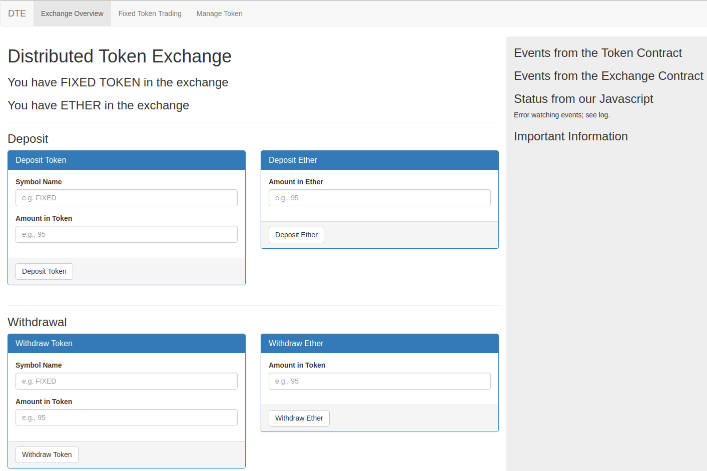
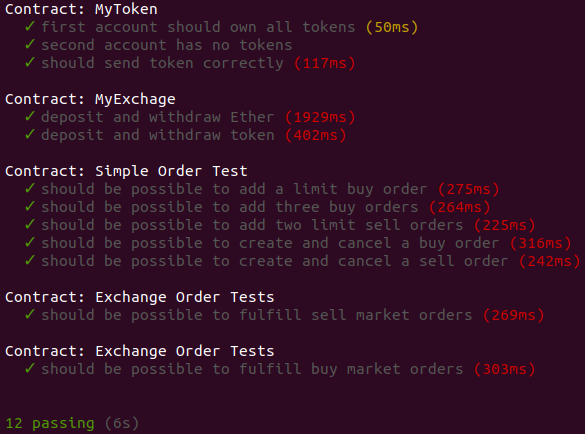

# This project implements an Exchage for trading different cryptocurrencies.

The webpage is hosted at Github Pages [https://artoriaren.github.io/ExchageSmartContract/](https://artoriaren.github.io/ExchageSmartContract/).

## Dependencies
testrpc v6.0.3, truffle 4.1.7, npm, Metamask. This project is developed with Remix, the online Solidity IDE.

### Install truffle
```bash
sudo npm install -g truffle@4.1.7
```

In case you need to uninstall truffle, use the following command:
```bash 
sudo npm uninstall -g truffle
```

### Install testrpc
```bash
sudo npm install -g ethereumjs-testrpc --no-optional
```

## How to Run Test
1. In one terminal, run the following command:
    ```bash
    testrpc
    ```
2.  In another terminal, run the following command:
    ```bash
    truffle test
    ```
    This command runs all test files under the `/test` folder. You should see ouptut like the following figure.


3. To run a particular test file, e.g. `03_trading_simple.js` , use the following command:
    ```bash
    truffle test ./test/03_trading_simple.js
    ```

## How to Run Web Application
Open a terminal and change directory to the root of this project. Use the following command
to install all the dependencies in the `package.json` file.
```bash
npm install
```

If you run into some errors, try ``npm cache clean`` and then install again use the above command.

1. In one terminal window, run the following command:
    ```bash
    testrpc
    ```
    This project use web3 in Metamask. Please enable Metamask extension and
    import accounts returned by the above command. Alternatively, you can run testrpc with
    mnemonics so that you do not have to import new accounts every time.
    ```bash
    testrpc -m '<mnemonics>'
    ```
2. To deploy all smart contracts under the `/contracts` folder,
 open a second terminal window, change directory to the root of this repo,  and run the following commmand:
    ```bash
    truffle migrate
    ```

3.  To start the web server,  open a third terminal window, run the following command:
    ```bash
    npm run dev
    ```
    This command will run the script`dev` in the `package.json` file.
    It starts the webpack server.
4. Open a web browser and connect to `localhost:8080`. 
You will see the webpage displayed.

## Test via Browser
Before testing the front-end, make sure to import the first and second accounts to Metamask. 
Since the first account 
has been used to deploy smart contracts, its Ether balance will be less than 100. 
All "FIXED" tokens, 1M, belong to the first accounts. And She is also 
the owner of the two smart contracts---FixedSupplyToken and Exchange.

### Manage Token Tab
1. Send Token
    
    Fill in "Amount in Token" with `50`, "To (Address)" with the second account 
    address. Then click on "Send Token" button. Metamask will pop up a page
    asking for confirmation. Click on "Confirm".
    
    You should see an "New Event: Transfer" under the "Events from the 
    Token Contract" label and the "Status from Javascript" displays
    "Transaction Complete!" on the log panel.

2. Add Token to Exchange
    
    In the terminal window where you execute `truffle migrate` previously, copy 
    the address following "FixedSupplyToken:" and paste it to "Address of Token".
    "Name of the Token" must be given, otherwise it will be an empty string. 
    Then click on "Add Token to Exchange" button.
     Metamask will pop up a page asking for confirmation. Click on "Confirm".

    You should see an "New Event: TokenAddedToSystem" under the  "Events from the 
    Exchange Contract" label on the log panel.
    
### Exchange Overview Tab
1. Display Token and Ether balance
    
    Token is hard coded to "FIXED", so its balance can only be displayed after
    you add "FIXED" token to the Exchange on the "Manage Token Tab".

2. Deposit Token
    
    Step 1. In the "Manage Token" tab, approve the Exchange can spend a certain
    amount of tokens in our name by filling out the "Approve Token Allowance" table with 
    the Exchange address as "To (address)".
    
    Step 2. Go to the "Exchange Overview" tab and fill out the "Deposit Token" tab.
    Notes that the amount should not exceed that filled in Step 1. This will  credit
    the amount of tokens inside the Exchange to our address.
    
3. Withdraw Token
    
    Fill the "Withdraw Token" table. You should see token balance displayed at 
    the top of the webpage changes.
    
If Ether or Token balance is not updated automatically, please refresh the webpage manually.

### Fixed Token Trading Tab
Prior to buying and selling any tokens, add the token to the Exchange in the "Manage Token" tab
and depoist both token and ether to the Exchange in the "Exchange Overview" tab.

1. Sell Token

Fill the "Sell Token" form in the "Fixed Token Trading" tab. Click on "Sell Token" button.  
 Metamask will pop up a page asking for confirmation. Click on "Confirm".
 You should see both update in the "Order Book - Ask" and "Limit orders" 
 event on the log panel. 

    
2. Buy Token

Fill the "Buy Token" form in the "Fixed Token Trading" tab. Click on "Buy Token" button.  
 Metamask will pop up a page asking for confirmation. Click on "Confirm". Depending on the
 price of this buy order, it may be fulfilled directly or added to buyOrderBook as a limit
 order. If it can be fulfilled, you should see "Fulfilled orders" 
 event on the log panel; otherwise, you should see both update in the "Order Book - Bid" and "Limit orders" 
 event on the log panel. 
 
## Note
1. Whenever you restart `testrpc`, run `truffle migrate` again.
1. Refresh the webpage each time you switch account in Metamask, restart `testrpc`, 
 or re-run `truffle migtrate`.
2. The first account created by `testrpc` is the account used for deploying contracts.
3. Token with the same name cannot be added to our Exchange twice. When testing
    the `addTokenToExchange` function, you may need to use `truffle migrate
    --reset` to re-deploy the two contracts so that the Exchange has a fresh
    state.
    


